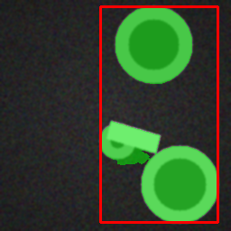

## Industrial Vision Starter (Synthetic Segmentation + ONNX)

**DE:** Referenzprojekt für industrielle Computer Vision mit Fokus auf *sauberes Engineering*:
synthetische Daten → Training → Inferenz → optionaler ONNX-Export.  
**EN:** Reference project for industrial computer vision focusing on *clean ML engineering*:
synthetic data → training → inference → optional ONNX export.

**Author / Autor:** Roger Seeberger

---

## 🇩🇪 Projektbeschreibung

Dieses Repository ist ein **end-to-end Blueprint** für ein typisches Industrial-Vision-Setup:

- **Synthetische Datengenerierung** (keine proprietären Daten nötig)  
- **Binary Segmentation** mit einem kleinen U-Net (PyTorch)  
- **Inference** inkl. Mask-Overlay + Bounding Box  
- **Optional:** **ONNX Export** und ONNXRuntime-Inference / Benchmark

**Warum synthetische Daten?**  
Damit das Repo **öffentlich** sein kann, ohne echte Kundendaten oder IP zu veröffentlichen. Das Ziel ist:  
**Struktur, Reproduzierbarkeit, CLI-Flow und Deployment-Pattern** zeigen – nicht „Top-Accuracy auf geheimen Daten“.

---

## 🇬🇧 Project Overview

This repository is an **end-to-end blueprint** for a typical industrial vision pipeline:

- **Synthetic data generation** (no proprietary datasets required)  
- **Binary segmentation** using a small U-Net (PyTorch)  
- **Inference** with mask overlay + bounding box  
- **Optional:** **ONNX export** and ONNXRuntime inference / benchmarking

**Why synthetic data?**  
So the repo can be public without leaking customer data or core IP. The goal is to demonstrate:  
**clean structure, reproducibility, CLI workflow, and deployment patterns**.

---

## Features
- `ivs synth`  → generate synthetic images + masks
- `ivs train`  → train U-Net on synthetic segmentation
- `ivs infer`  → inference (torch or onnx) with overlay output
- `ivs export-onnx` → export model to ONNX (optional)
- `ivs bench`  → ONNXRuntime benchmark (optional)

---

## Example (synthetic) / Beispiel (synthetisch)

<table>
  <tr>
    <th>Input image</th>
    <th>Target mask</th>
    <th>Model output</th>
  </tr>
  <tr>
    <td></td>
    <td></td>
    <td></td>
  </tr>
</table>


## Setup (Ubuntu 24.04, Python 3.12.x)

### 1) Create venv
```bash
sudo apt update

sudo apt install -y python3.12-venv

python3.12 -m venv .venv

source .venv/bin/activate

python -m pip install -U pip

```
## Quickstart

## Setup (Ubuntu 24.04, Python 3.12.3)

### 1) Create venv
```bash
sudo apt update

sudo apt install -y python3.12-venv

python3.12 -m venv .venv

source .venv/bin/activate

python -m pip install -U pip
```

### 2) Install base dependencies + project
```bash
pip install -r requirements.txt

pip install -e .
```

### CPU only
```bash
pip install torch==2.9.1 torchvision==0.24.1 torchaudio==2.9.1 \
  --index-url https://download.pytorch.org/whl/cpu
```

### GPU (recommended if you have NVIDIA)
This repo works with different CUDA wheel variants depending on your driver / environment.
Example for CUDA 13.0 wheels (cu130):

Note: In many setups cu126 / cu128 also works fine. The important part is a compatible NVIDIA driver.
If you want to switch, just replace cu130 with cu128 or cu126 in the index URL:

https://download.pytorch.org/whl/cu128

https://download.pytorch.org/whl/cu126

(Use the official PyTorch selector if you’re unsure.)
```bash
nvidia-smi

python -c "import torch; \
print('torch', torch.__version__); \
print('built cuda', torch.version.cuda); \
print('cuda available', torch.cuda.is_available()); \
print('gpu', torch.cuda.get_device_name(0) if torch.cuda.is_available() else None)"
```

### Install (CUDA 13.0 / cu130)
```bash
pip uninstall -y torch torchvision torchaudio

pip install torch==2.9.1 torchvision==0.24.1 torchaudio==2.9.1 \
  --index-url https://download.pytorch.org/whl/cu130
```

### 1) Generate demo data
```bash

## Smoke test (CPU/GPU) – consistent run folder outputs

### 1) Generate demo data

ivs synth --n 20 --out-dir data/demo
```

### 2) Train (auto picks CUDA if available)
```bash
ivs train --epochs 1 --batch-size 8 --device auto
```
### 3) Get latest checkpoint + run dir
```bash
CKPT=$(find runs -maxdepth 3 -type f -name "model.pt" | sort | tail -n 1)

echo "CKPT=$CKPT"

RUN_DIR=$(dirname "$CKPT")

echo "RUN_DIR=$RUN_DIR"
```

### 4) Torch inference (writes next to checkpoint by default)
```bash
CKPT=$(find runs -maxdepth 3 -type f -name "model.pt" | head -n 1)

ivs infer data/demo/images/00000.png "$CKPT" --device auto --out out.png
```

### 5) Optional: ONNX export + ONNX inference (same run folder)
```bash
pip install onnx onnxruntime onnxscript

ivs export-onnx "$CKPT"
# Output: $RUN_DIR/model.onnx (+ $RUN_DIR/model.onnx.data if needed)

ivs infer data/demo/images/00000.png "$CKPT" --backend onnx --device cpu
# Output: $RUN_DIR/out_onnx.png
```

### 6) Optional: ONNX benchmark
```bash

ivs bench "$RUN_DIR/model.onnx" --device cpu --n 200
```


### Optional: GPU training explicitly
```md
```
```bash
ivs train --epochs 1 --batch-size 8 --device cuda
```


